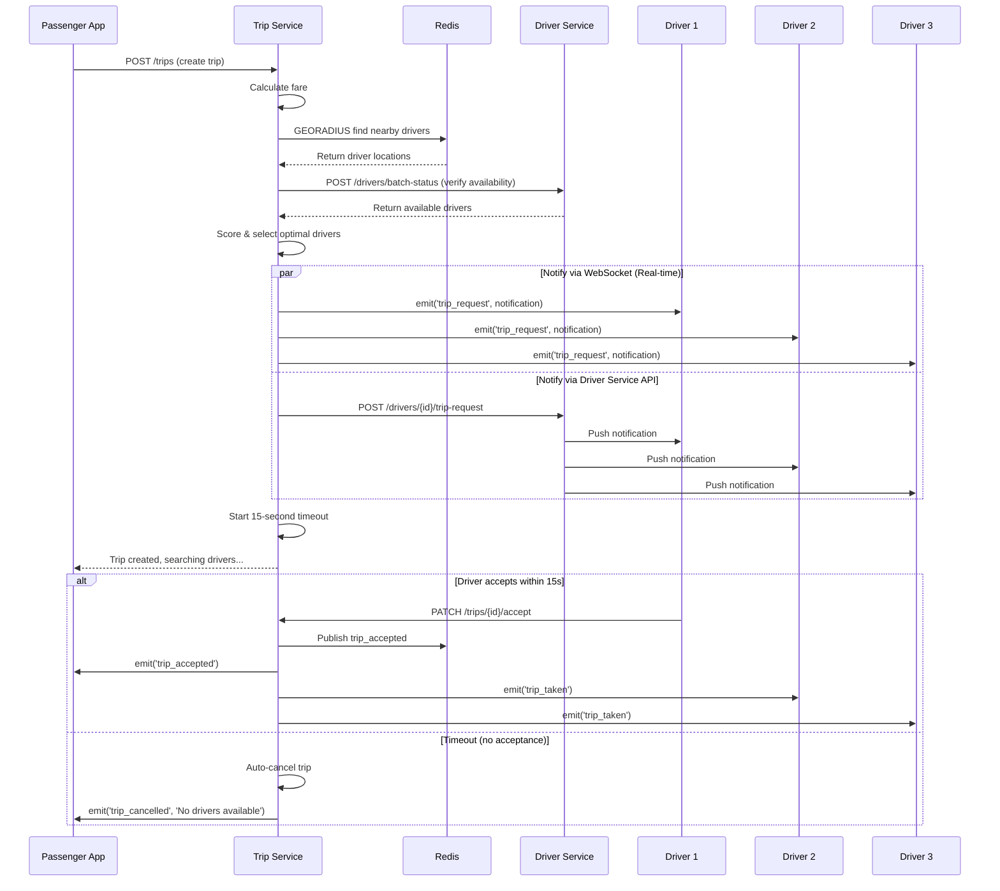

# 🔄 Cơ chế Thông báo Real-time trong UIT-Go Trip Service

## **1. 📱 Flow "Có cuốc xe mới" cho Tài xế**



## **2. 🔄 Real-time WebSocket Architecture**

### **Connection Setup:**

```javascript
// Driver App connects to WebSocket
const socket = io("ws://trip.localhost:81");

// Authentication
socket.emit("authenticate", {
  userId: driverId,
  userRole: "DRIVER",
  token: jwtToken,
});

// Listen for new trip requests
socket.on("trip_request", (notification) => {
  // notification = {
  //   type: 'new_trip_request',
  //   tripId: '...',
  //   pickup: { lat, lng, address },
  //   destination: { lat, lng, address },
  //   estimatedFare: 25000,
  //   distance: 2.5,
  //   timeout: 15,
  //   timestamp: '2025-09-28T...'
  // }

  showTripRequestDialog(notification);
  startAcceptanceTimer(15); // 15-second countdown
});
```

### **Trip Request Notification Data:**

```javascript
{
  "type": "new_trip_request",
  "tripId": "66f123abc456def789",
  "pickup": {
    "address": "123 Nguyen Hue, Q1, HCMC",
    "latitude": 10.7769,
    "longitude": 106.7009
  },
  "destination": {
    "address": "456 Le Loi, Q3, HCMC",
    "latitude": 10.7686,
    "longitude": 106.6917
  },
  "estimatedFare": 25000,
  "distance": 2.5,
  "timeout": 15,
  "message": "New trip request available",
  "timestamp": "2025-09-28T10:30:00.000Z"
}
```

## **3. 📍 Cập nhật Trạng thái Real-time**

### **Driver Location Updates:**

```javascript
// Driver App sends location updates
socket.emit("location_update", {
  latitude: 10.7769,
  longitude: 106.7009,
  tripId: "current_trip_id", // if driver has active trip
});

// Passenger receives driver location
socket.on("driver_location_update", (data) => {
  updateDriverMarkerOnMap(data.location);
  updateETA(data.estimatedArrival);
});
```

### **Trip Status Updates:**

```javascript
// When driver updates status
PATCH /trips/{id}/status
{
    "status": "DRIVER_ARRIVING",
    "location": { "latitude": 10.7769, "longitude": 106.7009 }
}

// Real-time notifications sent:
// To Passenger:
{
    "type": "driver_arriving",
    "message": "Your driver is on the way!",
    "tripId": "...",
    "driverLocation": { "lat": 10.7769, "lng": 106.7009 },
    "estimatedArrival": "5 minutes"
}
```

## **4. 🔔 Các loại Notifications**

### **For Drivers:**

```javascript
NOTIFICATION_TYPES = {
  NEW_TRIP_REQUEST: "new_trip_request", // 🚗 Có cuốc mới
  TRIP_CANCELLED: "trip_cancelled", // ❌ Khách hủy cuốc
  TRIP_TAKEN: "trip_taken", // 🚫 Cuốc đã được nhận
};
```

### **For Passengers:**

```javascript
NOTIFICATION_TYPES = {
  TRIP_ACCEPTED: "trip_accepted", // ✅ Tài xế đã nhận cuốc
  DRIVER_ARRIVING: "driver_arriving", // 🚗 Tài xế đang đến
  DRIVER_ARRIVED: "driver_arrived", // 📍 Tài xế đã đến
  TRIP_STARTED: "trip_started", // 🏁 Bắt đầu chuyến đi
  TRIP_COMPLETED: "trip_completed", // 🎉 Hoàn thành chuyến
  TIMEOUT_WARNING: "timeout_warning", // ⏰ Cảnh báo timeout
};
```

## **5. ⚡ Performance & Scalability**

### **Redis Pub/Sub Channels:**

```
trip:events                    # General trip events
trip:{tripId}:state           # Trip-specific state changes
driver:location:updates       # Driver location stream
user:{userId}                 # User-specific notifications
```

### **WebSocket Rooms:**

```
user:{userId}                 # Individual user room
trip:{tripId}                # Trip participants room
role:driver                  # All drivers
role:passenger              # All passengers
```

### **Connection Management:**

- **Persistent connections** với auto-reconnect
- **Heartbeat/ping-pong** để detect disconnections
- **Graceful handling** của network interruptions
- **Message queuing** cho offline users

## **6. 🛡️ Error Handling & Fallbacks**

### **WebSocket Failures:**

```javascript
// If WebSocket fails, fallback to HTTP polling
if (!socket.connected) {
  setInterval(() => {
    fetch("/api/trips/notifications/poll")
      .then((response) => response.json())
      .then((notifications) => {
        notifications.forEach(handleNotification);
      });
  }, 2000); // Poll every 2 seconds
}
```

### **Driver Service Integration:**

```javascript
// Primary: WebSocket notification
notificationService.notifyDriversAboutTripRequest(driverIds, tripData);

// Backup: Direct API calls to Driver Service
driverMatchingService.notifyDriversAboutTrip(drivers, tripData);

// Fallback: SMS notifications (if critical)
if (emergencyMode) {
  smsService.sendTripRequest(drivers, tripData);
}
```

## **7. 🧪 Testing Real-time Features**

### **WebSocket Client Test:**

```javascript
// Test driver receiving trip requests
const io = require("socket.io-client");
const socket = io("ws://localhost:3000");

socket.emit("authenticate", {
  userId: "driver123",
  userRole: "DRIVER",
  token: "jwt_token",
});

socket.on("trip_request", (data) => {
  console.log("New trip request:", data);

  // Simulate acceptance after 5 seconds
  setTimeout(() => {
    fetch(`/api/trips/${data.tripId}/accept`, {
      method: "PATCH",
      headers: { Authorization: `Bearer ${token}` },
    });
  }, 5000);
});
```

## **8. ✅ Summary**

**UIT-Go Trip Service provides REAL-TIME notifications through:**

1. **🔌 WebSocket (Socket.IO)** - Primary real-time channel
2. **📡 Redis Pub/Sub** - Cross-service messaging
3. **🔄 HTTP APIs** - Fallback and integration
4. **⏱️ 15-second timeout** - Automatic trip cancellation
5. **📍 Location streaming** - Real-time driver tracking
6. **🎯 Targeted notifications** - Role-based messaging

**Performance targets:**

- **< 100ms latency** for WebSocket messages
- **99.9% delivery rate** for critical notifications
- **10,000+ concurrent connections** support
- **Auto-scaling** with Redis clustering

**Tất cả notifications đều được gửi REAL-TIME qua WebSocket! 🚀**
